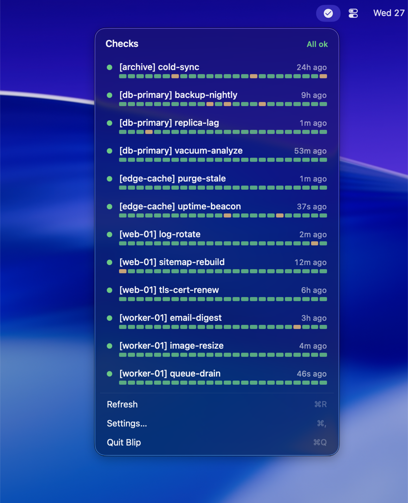
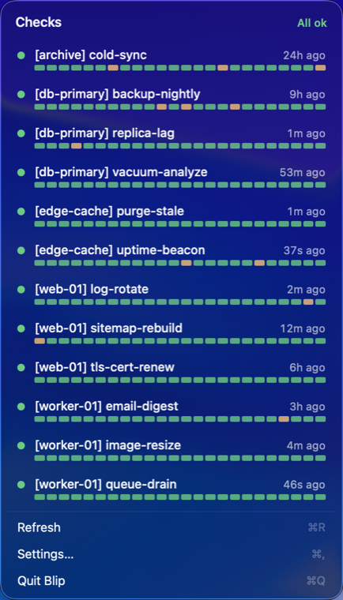
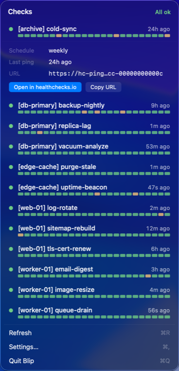
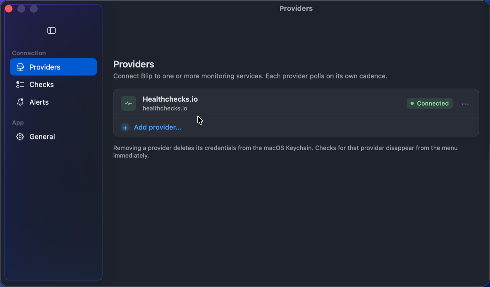
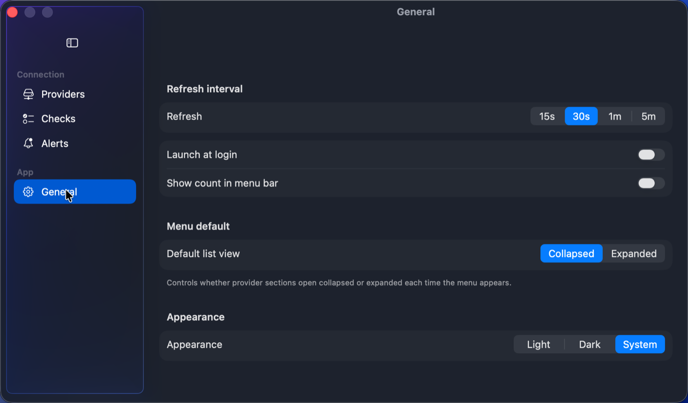

# homebrew-blip

The official [Homebrew](https://brew.sh) tap for **[Blip](https://github.com/jamielaird/blip)** — a tiny macOS menu-bar monitor for [healthchecks.io](https://healthchecks.io).

Every check at a glance. Quiet when things are fine, loud when they're not.



## Install

```sh
brew install --cask jamielaird/blip/blip
```

That's it — the cask strips quarantine on install, so Blip opens cleanly on first launch despite being ad-hoc signed (no `--no-quarantine` or right-click → Open needed). Requires **macOS 14 (Sonoma) or later**. Universal binary (Apple Silicon + Intel).

> Always fully-qualify the cask as `jamielaird/blip/blip`. An unrelated app of the same name exists in the default Homebrew tap, so the bare `blip` token is ambiguous.

Then click the menu-bar glyph → **Settings…** → **Providers** → **Add provider…** and paste your healthchecks.io API key.

## Update

```sh
brew update
brew upgrade --cask jamielaird/blip/blip
```

## Uninstall

```sh
brew uninstall --cask jamielaird/blip/blip          # remove the app
brew uninstall --zap --cask jamielaird/blip/blip    # also remove preferences
```

## What you get

<table>
  <tr>
    <td width="50%" valign="top">
      
      <p align="center"><em>Checks grouped by provider, with an at-a-glance summary header.</em></p>
    </td>
    <td width="50%" valign="top">
      
      <p align="center"><em>Expand any check for schedule, timeline, URL, and quick actions.</em></p>
    </td>
  </tr>
</table>

- **Menu-bar glyph** that reflects your worst current state — OK, late, or down.
- **Recent-pings timeline** per check, plus schedule, last ping, and ping URL.
- **Native notifications** on down / late / recovery, deduped and primed on launch.
- **Keychain-stored API key** — never written to disk in the clear.
- **Self-hosted friendly**, with configurable refresh (15s / 30s / 1m / 5m).
- **Light / dark / system** appearance and optional launch-at-login.
- Agent app — no Dock icon, no window clutter.

<table>
  <tr>
    <td width="50%" valign="top">
      
      <p align="center"><em>Settings · Providers — hosted or self-hosted.</em></p>
    </td>
    <td width="50%" valign="top">
      
      <p align="center"><em>Settings · General — refresh, login, appearance.</em></p>
    </td>
  </tr>
</table>

---

A free, open-source project — not affiliated with or endorsed by healthchecks.io.
